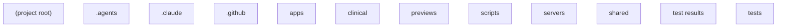

# 3. arh-family-lab — how things flow

_How the parts connect. The diagram and table below are generated from verified data, not drawn by hand._

_No connections were inferred between the parts (manual generated without AI assistance, or no relationships were found)._
