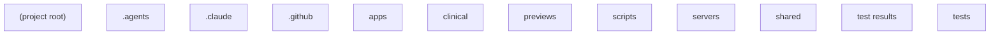

# arh-family-lab — Operations & Maintenance Manual

Generated: 2026-08-07T07:06:45+00:00

This manual explains what this project does, how its parts connect, where it
came from, what was decided and why, how to operate it, and what to do when
it breaks. It is written for the project owner, not for programmers.

## Contents

- [At a glance](01-at-a-glance.md)
- [The moving parts](02-moving-parts.md)
- [How things flow](03-how-things-flow.md)
- [Where it came from](04-where-it-came-from.md)
- [Decisions and why](05-decisions-and-why.md)
- [Operating it](06-operating-it.md)
- [When things break](07-when-things-break.md)
- [Glossary](08-glossary.md)

## How the parts connect

## Reading guide

- Chapters marked with an "AI-drafted" note were drafted by an AI assistant
  and must be verified against the sources they cite before you rely on them.
- All other chapters were generated directly from project files by
  deterministic code, with no AI wording.
- Citations like `path:12-40` point at exact lines in the project files.
